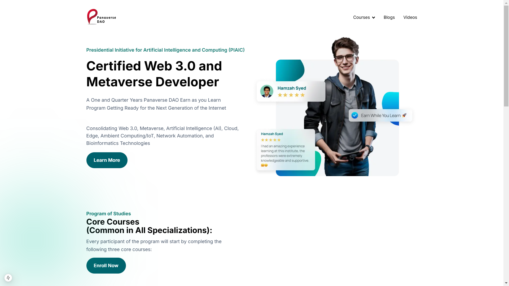

# 🌐 Panaverse

This project is a clone of the Panaverse website built with **Nextjs** and integrates a design inspired by [Figma](https://www.figma.com/design/d85Qhq3DcaZaamPRmvkZ9P/Panaverse-Clone?node-id=1-23&node-type=frame&t=HzElex8z9vZ4cjjH-0-). It demonstrates proficiency with React, component-based architecture, and layout management for responsive interfaces.

## 📸 Screenshots & Demo

Here’s a preview of the Panaverse Clone project in action. For a complete visual guide, refer to the [Figma design link](https://www.figma.com/design/d85Qhq3DcaZaamPRmvkZ9P/Panaverse-Clone?node-id=1-23&node-type=frame&t=HzElex8z9vZ4cjjH-0-).

### Project Images

Below are some rectangular images showcasing various sections of the project:

<table>
<tr>
    <td>
        
    </td>
    <td>
        
    </td>
</tr>
<tr>
    <td>
        
    </td>
    <td>
        
    </td>
</tr>
</table>

### Company ID Card


### 🔗 Project Links
- **Live Demo**: [Panaverse Clone - Demo](#)
- **Figma Design**: [Panaverse Figma Design](https://www.figma.com/design/d85Qhq3DcaZaamPRmvkZ9P/Panaverse-Clone?node-id=1-23&node-type=frame&t=HzElex8z9vZ4cjjH-0-)

---

## 📋 Table of Contents
1. [Project Overview](#-project-overview)
2. [Project Setup](#-project-setup)
   - [1. Initialize the React Project](#1-initialize-the-react-project)
   - [2. Install Dependencies](#2-install-dependencies)
3. [Component Breakdown](#-component-breakdown)
4. [Figma Design Integration](#-figma-design-integration)
5. [Screenshots & Demo](#-screenshots--demo)
6. [Contributing](#-contributing)
7. [License](#-license)

---

## 🔍 Project Overview

The Panaverse Clone project is built to replicate the **UI and interactive elements** shown in the provided Figma design. This project is suitable for **internship preparation** and showcases skills with React, component-based structure, and CSS styling using Flexbox/Grid for responsiveness.

### 🔧 Key Features
- Responsive design that adapts to different screen sizes.
- Interactive components built with React.
- Smooth navigation using `react-router-dom`.

---

## 🚀 Project Setup

### 1. Initialize the React Project

To get started, create a new React app by running:
```bash
npx create-react-app panaverse-clone
cd panaverse-clone
